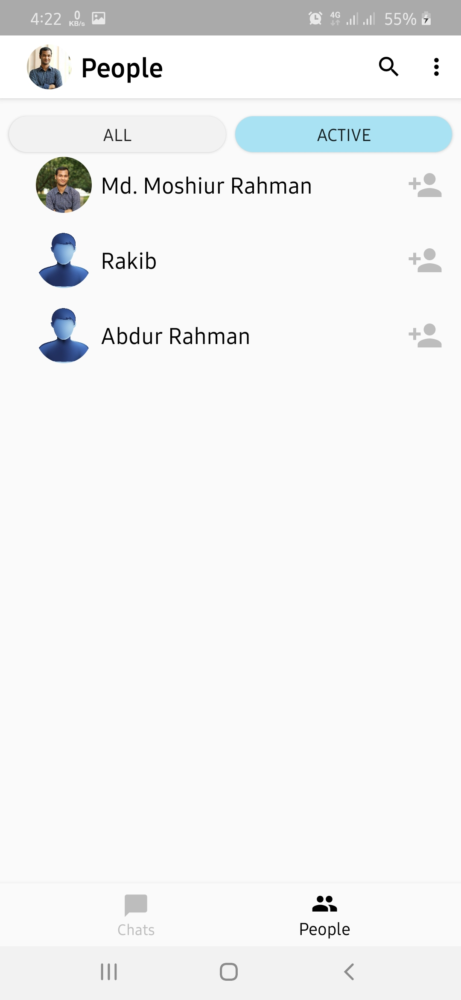

# Alapon-Chatting-Application

It's an android messaging application which allows versatilities in sign-in options(Facebook, Gmail, Phone number).
Languages or technologies it employed: Java, XML, Firestore, Firebase, Facebook SDK.

Some screenshots are : 

